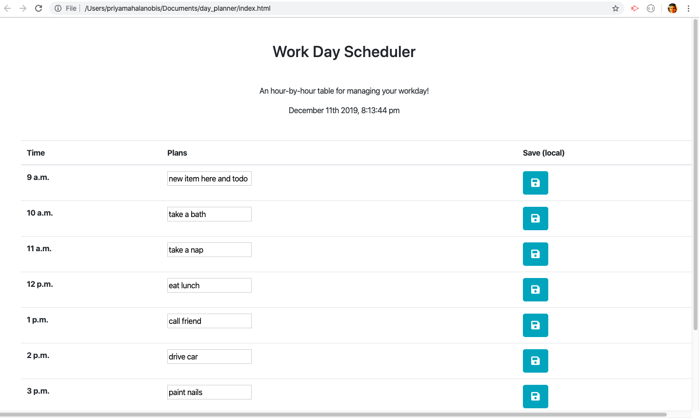

# My Day Planner

In the Day Planner assignment, I was able to build a website which practiced utilizing local memory storage. Additionally, I had an opportunit to use libraries such as jQuery and moments.js for the first time.

The site consists of a table which displays horizontal rows for each hour of the work day, beginning with 9 a.m. and ending with 5 p.m. In addition to denoting the hour, each row contains a form for user input and a "save" button. Once the user inputs their plans for any given hour, that input is saved to their browser's local storage when they click the "save" button. I was able to accomplish this functionality through the use of jQuery methods. 

The pseudocode behind this functionality is: upon the clicking of a particular hour's 'save' button, the text value of their input for that hour is saved to the local storage. Additionally, the 'getItem' method is used to pull up any pre-existing text upon the re-opening or refreshing of the page.

While I was able to achieve the above functionality, and additional element to be incorporated is the changing of each row's color depending on the current hour of the day. Using the moments.js library, I hope to create code which will enable each row to be dynamically color-coded; the current hour of the day would appear green, while previous hours would appear grey and future hours would appear red.

### GH Pages URL:  https://pmahalan.github.io/day_planner/

